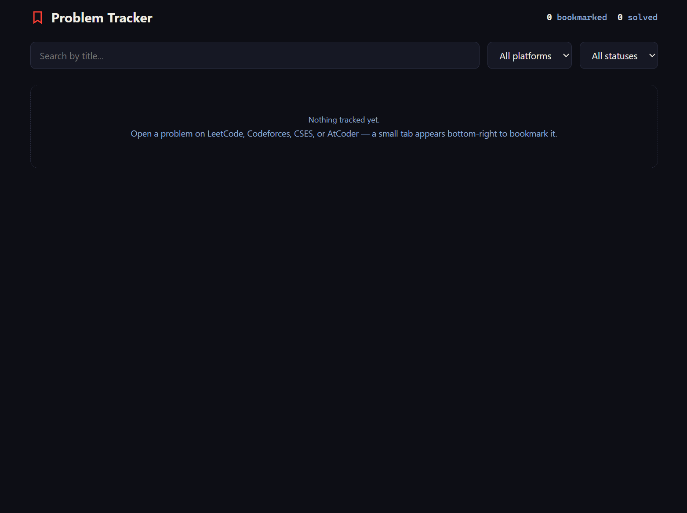
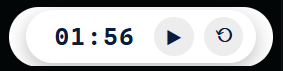
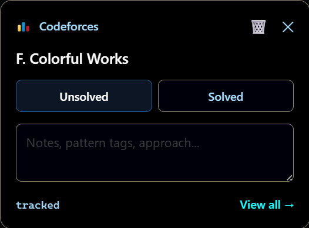

# Problem Tracker

Bookmark, time, and track your competitive programming problems directly from the problem page. No separate apps, no messy spreadsheets.

Problem Tracker is a lightweight Chrome extension designed for developers who practice on LeetCode, Codeforces, CSES, and AtCoder. It injects a seamless, native UI right into the webpage, allowing you to save problems, take notes, and track your solve times without breaking your focus.

## Core Use Cases

### 1. Centralized Dashboard

Click "View All" to open your master dashboard. Designed with a deep-dark developer aesthetic, this is where you can search by title, filter by platform or status, and review your time spent and custom notes across all platforms in one place.

### 2. Smart Auto-Timer

The moment you open a problem, a clean, floating stopwatch automatically starts ticking. It runs in an isolated frame, meaning it is completely immune to visual interference from extensions like Dark Reader. It pauses automatically when you mark the problem as "Solved" and safely saves your time even if you close the tab and return later.

### 3. In-Page Bookmarking & Notes

A sleek, unobtrusive floating icon lives on supported platforms. Click it to open the tracker panel directly over the problem. From here, you can toggle the status between Unsolved and Solved, type out your approach, add pattern tags, or just bookmark it for a future review session. 

## Supported Platforms
The tracker automatically activates on problem pages for:
* LeetCode
* Codeforces
* CSES
* AtCoder

## How to Install (Developer Mode)
Since this extension is loaded locally, installation takes only a few seconds:
1. Open Chrome and navigate to `chrome://extensions`.
2. Toggle **Developer mode** ON (in the top right corner).
3. Click the **Load unpacked** button in the top left.
4. Select the folder containing your `manifest.json` and extension files.
5. Pin the extension to your Chrome toolbar for one-click access to your master dashboard.